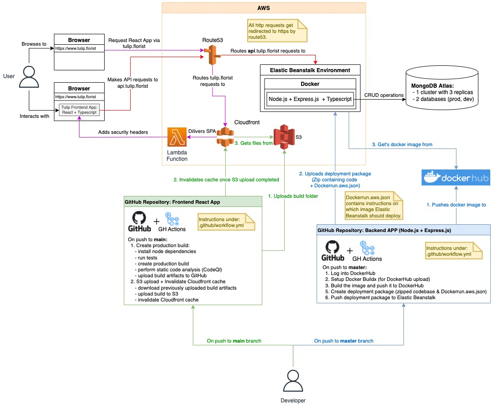

# Tulip

> Open source document reader

Video showing all the features of the application can be found [here](https://www.loom.com/share/de36358b3d624c4689de1cf891764ff8).

## Development setup

Local development setup for the Tulip (frontend) application.

Clone the repository

Change into the `doc-viewer` folder

    cd doc-viewer

Install the dependencies

    npm install

(Optinal) Create a `.env` file with the following variables to connect to the backend (Find setup of backend [here](https://github.com/tulip-florist/tulip-backend))

```
REACT_APP_NODE_ENV=development
REACT_APP_API_BASE_URL=<url-to-backend>
```

Run the application

    npm start

Or run storybook

    npm run storybook

## Architecture & CI/CD Pipelines

### Simplified Data Flow


### Detailed Data Flow


### Component structure


### Simplified CI/CD Pipelines flow


### Detailed Architecture & CI/CD Pipelines


